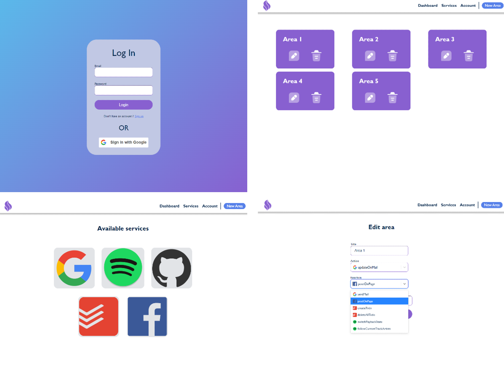

# Area 21

## Table of content

- [Introduction](#introduction)
- [Project goals](#project-goals)
  - [What is an AREA](#what-is-an-area)
- [Visuals](#visuals)
  - [Web application](#web-application)
  - [Mobile application](#mobile-application)
- [Technical documentation](#technical-documentation)
- [Authors and acknowledgment](#authors-and-acknowledgment)
- [License](#licence)

## Introduction

Hello, welcome to the documentation page of our Area project !

On this page, you will find the description of how our project work, how to run it, technical examples of features provided.

You can also find an explanation of how to add new features following the [contributing documentation](./CONTRIBUTING.md)

For more information about **installation** please refer to [the following instructions](./docs/Installation.md)

## Project goals

The goal of the Epitech Area project is to create an [IFTTT](https://ifttt.com/explore) like web page and mobile application.

It let you create an AREA.

### What is an AREA

**AREA** is the combination of **Action** and **REAction**.

**If this** action happen **then that** reaction is triggered.

## Visuals

### Web application

### Mobile application

## Technical documentation

For more information check the corresponding documentation:

- [Web application](./docs/web/Web.md)
- [Mobile application](./docs/mobile/Mobile.md)
- [Backend and database](./docs/backend/API.md)

## Authors and acknowledgment

Epitech project realized by:

- Benjamin Mouginet
- Juliette Dupin
- Denis Roux
- Lény Wilhelm
- Nathan Lemale

## Licence
