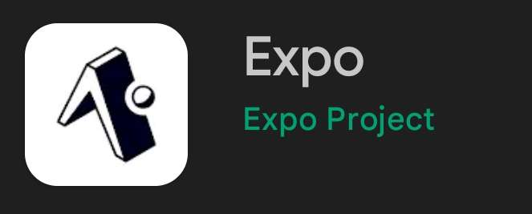

# How to install our Area21

## Table of content

- [Project setup](#project-setup)
  - [Create client information](#create-client-information)
  - [Environment setup](#environment-setup)
- [Docker and docker compose](#docker-and-docker-compose)
  - [Start Area21](#start-area21)
  - [Stop Area21](#stop-area21)
- [Front accessibility](#front-accessibility)
  - [Web application](#web-application)
  - [Mobile application](#mobile-application)
- [Reset database](#reset-database)
- [Postman](#postman)
- [Swagger](#swagger)

## Project setup

### Create client information

For every service implemented you will need a dedicated client id and client secret.

To do so create your application on any service here:

<a href="https://console.cloud.google.com/" target="_blank" rel="noreferrer">  </a>
<a href="https://developers.facebook.com/apps/" target="_blank" rel="noreferrer">  </a>
<a href="https://developer.todoist.com/appconsole.html" target="_blank" rel="noreferrer">  </a>
<a href="https://developer.spotify.com/dashboard/" target="_blank" rel="noreferrer">  </a>
<a href="https://github.com/settings/applications/" target="_blank" rel="noreferrer">  </a>
<a href="https://www.weatherapi.com/" target="_blank" rel="noreferrer">  </a>

<br/>

### Environment setup

Convert every `.env.example` to `.env` file and complete them accordingly.

<br/>

## Docker and docker compose

This application require [docker and docker compose](https://docs.docker.com/engine/install/) to work properly.

Don't forget to add docker group to your users.

```
sudo usermod -aG docker $USER
```

<br/>

### Start Area21

```
docker compose up -d --build
```

<br/>

### Stop Area21

```
docker compose down
```

<br/>

## Front accessibility

### Web application

After starting every container, the web application will be accessible at [localhost:8081](http://localhost:8081).

<br/>

### Mobile application

The mobile application require the expo go application.



Start the expo server:

`npx expo start`

Start your application and scan the QR code printed.

Make sure both expo server and your device are on the same network.

## Reset database

If you want to delete every data like (areas, user, service ...)

You can run the following command:

```
docker compose down && rm -rf backend/mysql_data
```

You can find more information about the database [here](backend/Databases.md)

<br/>

## Postman

The postman repository is accessible [here](https://www.postman.com/area21api/workspace/area/overview)

<br/>

## Swagger

The project's swagger is accessible at [http://localhost:8080/api-docs/](http://localhost:8080/api-docs/)
