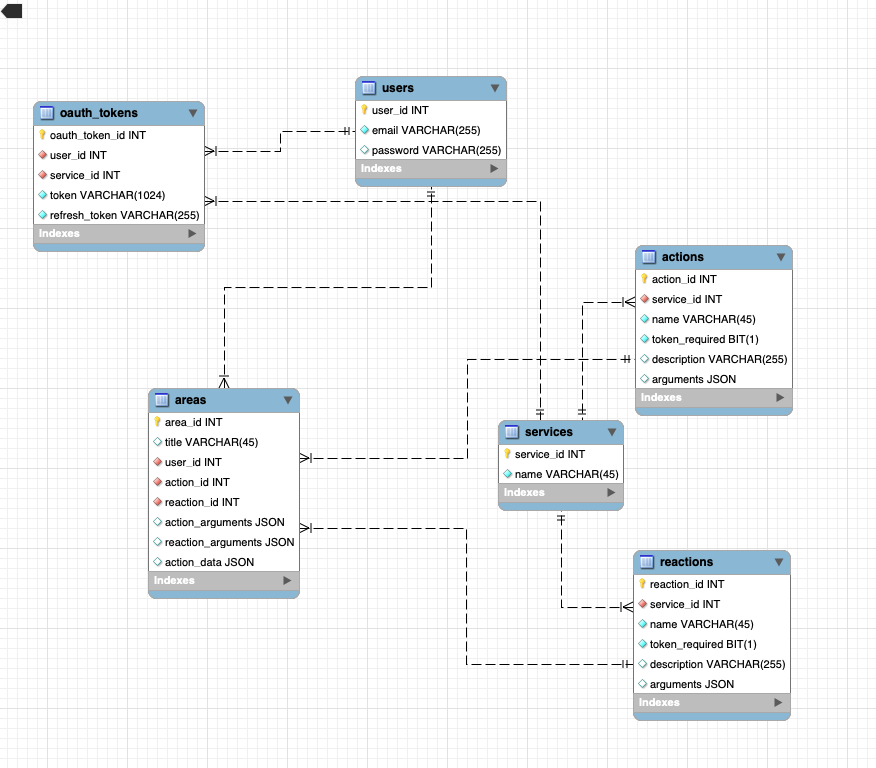

# Databases

### Databases architecture

In this project we use mysql for database.

For helping us we use MysqlWorkbench [download here]("https://www.mysql.com/products/workbench/")

this document shows the relationships between our sql tables, it is our database architecture 

You can download this file [here]("https://gitlab.com/epitech-it-2025/benjamin/area-21/-/tree/main/backend/sql")

