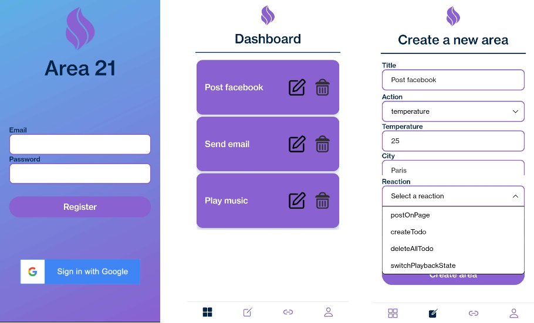
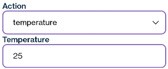
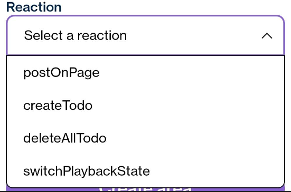

# Mobile application



<br/>

## Description

The mobile application is made with react-native and expo go.

Check out the project architecture [here](./MobileArchitecture.md)

<br/>

## Navigation and screens

We are using the [React navigation plugin](https://reactnavigation.org/docs/getting-started/) for every screen stack or navbar creation.


<br/>

## Request

Every request made with the back is with the [Axios library](https://github.com/axios/axios).

It let us make a lot of request type like GET, POST, PUT...

Here is an example:

```javascript
axios
  .get(
    `http://${params.route.params.target.ip}:${params.route.params.target.port}/dashboard/userid/${params.route.params.data.user_id}`,
    {
      headers: {
        Authorization: `Bearer ${params.route.params.data.token}`,
      },
    }
  )
  .then(async (response) => {
    if (response.status === 200) {
      setAreaData(response.data);
      return;
    } else {
      throw new Error("Failed to fetch areas");
    }
  })
  .catch((error) => {
    console.log("[Mobile] Error - Could not receive areas:", error);
    setErrorFlag(true);
  });
```

<br/>

## Components

A component is a reusable part of code such as a text, a button, or in our case an area.

It is composed by one `.tsx` file, here is the area and dropdown example.

<details>
<summary>Area component</summary>

<br/>


The [area component](../../mobile/components/Area.tsx) is one of the most important one. It is the purpose of the project indeed !

```javascript
  return (
    <View style={styles.AreaCard}>
      <View style={styles.TitleCard}>
        <Text style={styles.Title}>{props.title}</Text>
      </View>
      <View>
        <TouchableOpacity onPress={EditArea}>
          <Image style={styles.Icon} source={require('../assets/edit.png')} />
        </TouchableOpacity>
      </View>
      <View>
        <TouchableOpacity onPress={DeleteArea}>
          <Image style={styles.Icon} source={require('../assets/trash.png')} />
        </TouchableOpacity>
      </View>
    </View>
  );
}
```

Each component have its own style at the bottom of the file in a StyleSheet.

In this case, two actions can be triggered, access to the page to edit an area or to delete the area.

</details>

<br/>

<details>
<summary>Dropdown component</summary>

<br/>



The [dropdown component](../../mobile/components/DropDownList.tsx) is the main part of the area management.

It is an abstraction of [react-native-dropdown-picker](https://hossein-zare.github.io/react-native-dropdown-picker-website/docs).

It receives its data from the request of the ManageArea page.



</details>

<br/>

## Services

We are using [this expo library](https://docs.expo.dev/guides/authentication/) for OAuth connexion.

The implemented services are in shades of grey while the user is not connected.

Checkout the different areas and interactions available [here](../ServicesAndActions.md)


On press of a logo, it redirects the user to the corresponding OAuth page.

The logo become colorful after connexion.


