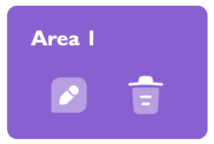
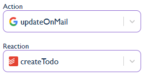
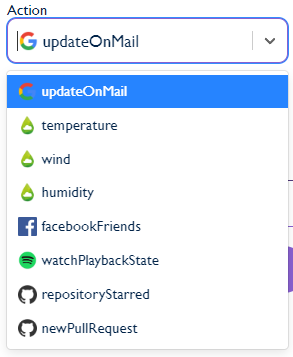

# Web application


<br/>

## Description

The web application is made with next js.

Check out the project architecture [here](./WebArchitecture.md)

<br/>

## Pages

We are using the router included in Next.js language.
The location of a file in the `pages` folder is related to the url.

Example:
- the file located at `/pages/area/new.js`
- the url page `http://localhost:8081/area/new`

<br/>

## Request

Every request made with the back is with the [Axios library](https://github.com/axios/axios).

It let us make a lot of request type like GET, POST, PUT...

All the requests are located in [Utils.ts](../../web/src/scripts/Utils.ts)

<br/>

## Components

A component is a reusable part of code such as a text, a button, or in our case an area.

It is composed by one `.tsx` file, here is the Area and Select example.

<details>
<summary>Area component</summary>

<br/>



The [area component](../../web/src/components/Area/Area.tsx) is one of the most important one. It is the purpose of the project indeed !

```javascript
  return (
    <div className={styles.area}>
      <p>{title}</p>
      <div>
        <button onClick={edit}>
          <Image
            src="/icons/Edit.png"
            alt="EditIcon"
            width={64}
            height={64} />
        </button>
        <button onClick={trash}>
          <Image
            src="/icons/Trash.png"
            alt="TrashIcon"
            width={64}
            height={64}
          />
        </button>
      </div>
    </div>
  );
```

Each component have its own style in the scss file linked to the component. ([Area.module.scss](../../web/src/components/Area/Area.module.scss))

In this case, two actions can be triggered, access to the page to edit an area or to delete the area.

</details>

<br/>

<details>
<summary>Select component</summary>

<br/>



The [select component](../../web/src/components/Select/Select.tsx) is the main part of the area management.

It is an abstraction of [react-select](https://react-select.com/home).

It receives its data from the request of the area edit/new page.



</details>

<br/>

## Services

We are using [the next auth library](https://next-auth.js.org/configuration/providers/oauth#built-in-providers) for OAuth connection.

The implemented services are in shades of grey while the user is not connected.

Checkout the different areas and interactions available [here](../ServicesAndActions.md)


On press of a logo, it redirects the user to the corresponding OAuth page.

The logo become colorful after connection.


